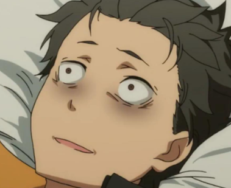

# Hi there! 👋 I'm `Atom`

🎓 Pursuing a degree in Computer Engineering and Digital Technology at Chulalongkorn University.

## About Me

  &nbsp;&nbsp;&nbsp; Very passionate about developing and coding, I began intense coding since high school. I devoted so much time to coding so I lost my Pro-league-like reflexes(shooting games), No time to catch up on new game patches, ... I also find myself entangled in the surreal realm of not knowing how to converse with a girl ... thi th-this is not my fault, n.. no no n- n-not my fault.</img>

- 😉 **Tech Enthusiast:** Self-Hosted Home Server (Linux, Containers, Networking, IaC)
- 😣 **Currently**: looking for a part-time job so I could pay off my 3-month rent debt.
- 😫 **Hobbies**: Anime, Manga, Coding, ~~Video Games~~ (Still play, but much less compared to the past)
  
## Open Source Contribution

-  **Tachiyomi Contributor:** PR merged in an open-source project. [here]([link-to-your-pull-request](https://github.com/tachiyomiorg/tachiyomi-extensions/pull/18931))

## Projects

- [YAKINIKU](https://github.com/Taihenc/YAKINIKU/) (🌐 Web-Dev) Group project of 4, but I'm the sole front/back-end developer.
  
- [MoeKot](https://github.com/Taihenc/MoeKot) (📱 Android) A side project so I become more comfortable with the Android development process.
- ~~🕹️ **Game Development (Unity):**~~ [Currently private]
- ~~🏡 **Self-Hosted Home Server:**~~ [Currently private]

## Skills

 
 
 

## Contact Me

<!-- 

<link rel="stylesheet" href="https://cdn.jsdelivr.net/gh/devicons/devicon@v2.15.1/devicon.min.css">
 
 
 
 <a href="https://www.w3.org/html/" target="_blank" rel="noreferrer">

 -->

Feel free to reach out, whether it's for collaboration, job opportunities, or just a tech(/weeb) chat! 🚀

<!--
**Taihenc/Taihenc** is a ✨ _special_ ✨ repository because its `README.md` (this file) appears on your GitHub profile.

Here are some ideas to get you started:

- 🔭 I’m currently working on ...
- 🌱 I’m currently learning ...
- 👯 I’m looking to collaborate on ...
- 🤔 I’m looking for help with ...
- 💬 Ask me about ...
- 📫 How to reach me: ...
- 😄 Pronouns: ...
- ⚡ Fun fact: ...
-->
